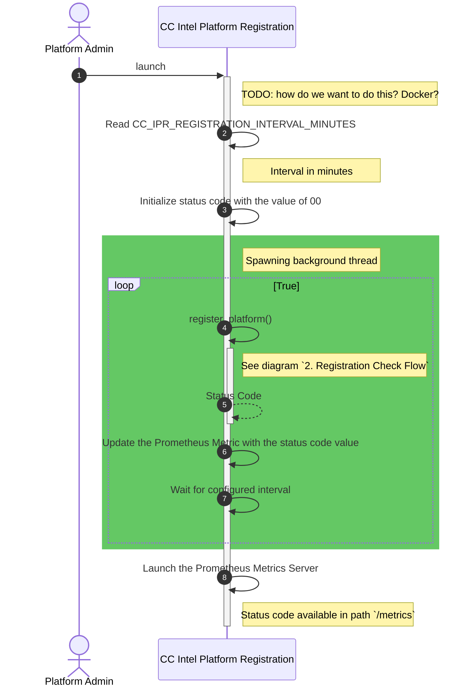
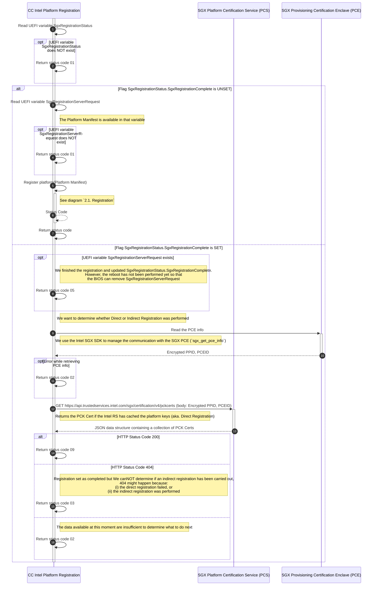
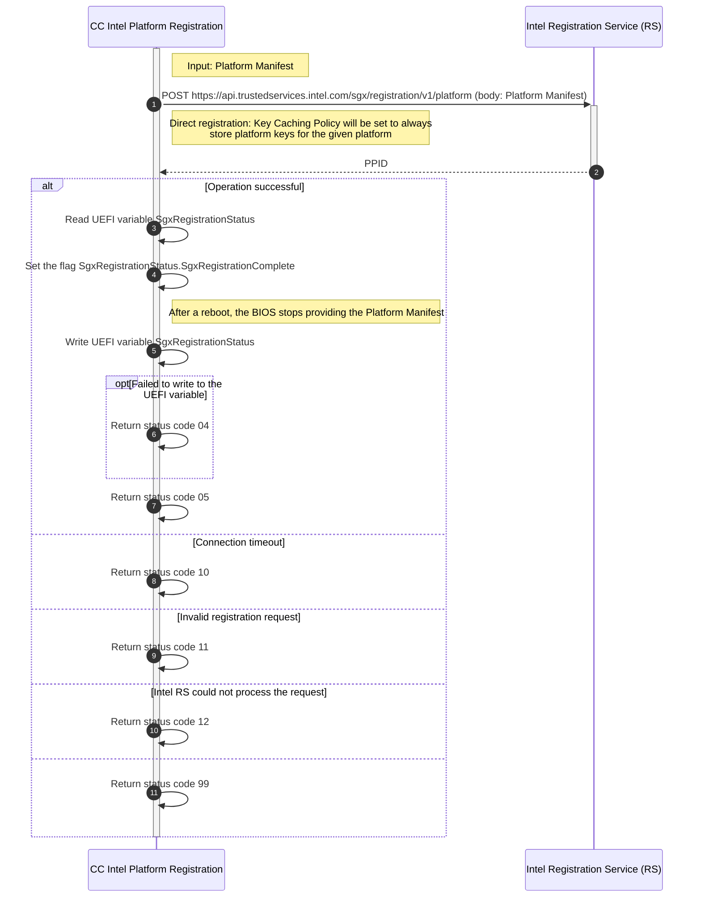

# Platform Registration Flow

The CC Intel Platform Registration Service is an application that registers a SGX-capable platform with the Intel Registration Service via HTTP requests [1].
The information required to register a platform with Intel is handled by the BIOS.
The BIOS makes the relevant SGX platform-dependent information, called a platform manifest, available to any third-party software via an UEFI variable.
A platform manifest [2] contains the *shared*[^1] platform keys that are encrypted using the Intel Registration Server’s Encryption Key.
A platform key is stored by each CPU on the platform and is encrypted with the CPU's unique hardware key.
Once a third-party software (e.g., CC Intel Platform Registration Service) reads the platform manifest, the BIOS expects a signal to stop sharing that manifest as it contains sensitive information (i.e., the platform keys).

Given a platform manifest, one can then register the platform with the Intel Registration Service, which stores the platform keys (through the direct registration [2]) to process further queries (e.g., to retrieve a Provisioning Certification Key (PCK) Certificate [3]).
This has the advantage that we don't need to handle the persistence of the platform manifests; we outsource that to Intel.
One can check if the direct registration was performed by checking the `Key Caching Policy` property of a PCK Cert [3].

To retrieve the PCK Certificate of a platform after it was registered with the Intel Registration service, necessary to carry out a successful attestation procedure by verifying quotes, one has to retrieve two pieces of information from the respective platform:
(1) its Provisioning Certification Enclave (PCE) ID; and 
(2) an encrypted PPID which is derived by the PCE from the respective platform keys.
The PCE is an Intel SGX architectural enclave that uses a PCK to sign REPORT structures for Provisioning or Quoting Enclaves.
These signed REPORTS contain the ReportData indicating that attestation keys or provisioning protocol messages are created on genuine SGX hardware [2].

The outcome of a successful platform registration with Intel is the capability to retrieve the platform's PCK Certificate from the Intel Platform Certification Service (PCS).

[^1]: *shared* is relevant in the context of multi-package platforms (i.e., multiple CPUs) where the CPUs negotiate the platform key to use.

## Limitation

- Addition or replacement of CPUs is not supported.

## Status Code

The platform registration service keeps a status code described below.

### Prometheus Implementation

To implement the status code above, we use [Prometheus Gauge Metric](https://prometheus.io/docs/concepts/metric_types/#gauge) `service_status_code`, and attach to it two [labels](https://prometheus.io/docs/concepts/data_model/#metric-names-and-labels): 
- `http_status_code`: to represent the HTTP status code returned by the performed HTTP request
- `intel_error_code`: a string, e.g. `InvalidRequestSyntax`, taken as-is, when available, from the Intel service reply's error code 

### Semantics

- `0X`: Registration status
  - `00`: Pending execution
  - `01`: SGX UEFI variables not available 
  - `02`: Impossible to determine the registration status; please reattempt
    - MIGHT contain metric label `http_status_code`
    - MIGHT contain metric label `intel_error_code`
  - `03`: Impossible to determine the registration status; please reset the SGX
    - MUST contain label `http_status_code`
  - `04`: Failed to persist the UEFI variable content
  - `05`: Platform registered successfully and a reboot is required
  - `09`: Platform directly registered
- `1X`: HTTP request status
  - `10`: Failed to connect to Intel RS
  - `11`: Invalid registration request
    - MUST contain metric label `http_status_code`
    - MIGHT contain metric label `intel_error_code`
  - `12`: Intel RS could not process the request
    - MUST contain metric label `http_status_code`
- `9X`: General errors
  - `99`: Unknown or not supported error; see logs

## Sequence Diagrams

### 1. Main Flow

### 2. Registration Check Flow

#### 2.1. Registration

To set the `Key Caching Policy` to true in a platform's PCK Certificate, we **must** register the Platform with Intel Registration Service first.
This service then stores the Platform Keys.
This procedure is called the direct registration and we follow it in the diagram below.

The flow below also supports `TCB Recovery` and `SGX Reset` [2].

## Artifacts

* *Platform manifest*: A BLOB containing the encrypted shared platform keys used to register the SGX platform with the Intel Registration Service
* *PPID*: Unique Platform Provisioning ID of the processor package or platform instance used by Provisioning Certification Enclave. The PPID does not depend on the TCB.
* *PCEID*: Identifier of the Intel SGX enclave that uses Provisioning Certification Key to sign proofs that attestation keys or attestation key provisioning protocol messages are created on genuine hardware
* *PCK Cert*: X.509 certificate binding the PCE's key pair to a certain SGX TCB state

## References

1. [Intel RS and Intel PCS API Specification](https://api.portal.trustedservices.intel.com/content/documentation.html)
2. [Intel SGX DCAP Multipackage SW](https://download.01.org/intel-sgx/sgx-dcap/1.9/linux/docs/Intel_SGX_DCAP_Multipackage_SW.pdf)
3. [SGX PCK Certificate Specification](https://download.01.org/intel-sgx/latest/dcap-latest/linux/docs/SGX_PCK_Certificate_CRL_Spec-1.4.pdf)